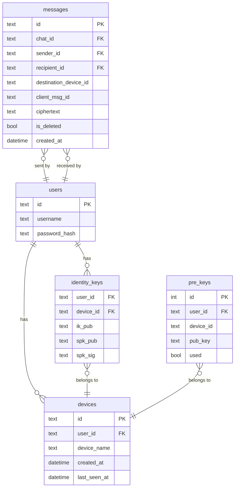

# feat: 4.1 — Полноценная multi-device архитектура

**Дата:** 2026-04-10  
**Этап:** 9  
**Приоритет:** Must  
**Источник:** `docs/next-session.md`, Signal Sesame spec, Signal-Server source

---

## Overview

Реализовать полноценную поддержку нескольких устройств одного пользователя:

1. `GET /api/keys/:userId` возвращает bundle для **всех** активных устройств
2. Клиент хранит отдельные ratchet-сессии per `(peerUserId, peerDeviceId)`
3. WS Hub отслеживает соединения на уровне `device_id`, доставляет сообщения на каждое устройство

---

## Problem Statement

### Текущее состояние (баги multi-device)

**Сервер:**
- `identity_keys` имеет `PRIMARY KEY (user_id)` — один row на пользователя. Новый вход с другого устройства **перезаписывает** IK предыдущего.
- `GetIdentityKey` — `SELECT ... WHERE user_id=?` — всегда возвращает один row.
- `PopPreKey` — `SELECT ... WHERE user_id=? AND used=0` — не фильтрует по `device_id`, смешивает OPK всех устройств.
- WS `client` struct не имеет `deviceID` — Hub не различает устройства одного пользователя.
- JWT claims не содержат `device_id`.

**Клиент:**
- `sessionKey(chatId, peerId)` → `${chatId}:${peerId}` — нет `deviceId`, все устройства одного пира конкурируют за одну ratchet-сессию → decrypt failures.
- `decryptMessage(chatId, senderId, payload)` — нет `senderDeviceId`.
- `GET /api/keys/:userId` возвращает один bundle, а не массив.

---

## Proposed Solution

Следовать Signal **Sesame spec** (signal.org/docs/specifications/sesame/):
- Сессия идентифицируется как `ProtocolAddress(userId, deviceId)` — не зависит от chatId.
- Сервер раздаёт bundle для каждого устройства отдельно.
- При отправке клиент создаёт **отдельный ciphertext для каждого устройства** получателя (и своих других устройств).
- Сервер хранит `destination_device_id` в таблице сообщений для offline fan-out.

---

## Technical Approach

### Архитектурная схема

```
Alice (device A1)  →  POST /api/messages
  ├─ ciphertext для Bob-device-B1
  ├─ ciphertext для Bob-device-B2
  └─ ciphertext для Alice-device-A2 (собственное устройство)

Сервер:
  ├─ сохраняет каждый ciphertext с destination_device_id
  ├─ WS → Bob-B1 (онлайн) ✓
  ├─ WS → Bob-B2 (онлайн) ✓
  └─ очередь → Alice-A2 (офлайн, заберёт при reconnect)
```

### Ключ ratchet-сессии

```
// БЫЛО: chatId:peerId (неверно)
// СТАЛО: peerId:peerDeviceId (Sesame spec)
const sessionKey = `${peerUserId}:${peerDeviceId}`;
```

---

## Implementation Phases

### Phase 1: DB Migration — `identity_keys` PK

**Файл:** `server/db/schema.go`

Migration #9: изменить PK `identity_keys` с `(user_id)` на `(user_id, device_id)`.

```sql
-- migration #9
ALTER TABLE identity_keys RENAME TO identity_keys_old;
CREATE TABLE identity_keys (
    user_id   TEXT NOT NULL,
    device_id TEXT NOT NULL,
    ik_pub    TEXT NOT NULL,
    spk_pub   TEXT NOT NULL,
    spk_sig   TEXT NOT NULL,
    PRIMARY KEY (user_id, device_id)
);
INSERT INTO identity_keys SELECT user_id, 'default', ik_pub, spk_pub, spk_sig
    FROM identity_keys_old;
DROP TABLE identity_keys_old;
```

> **Важно:** При миграции существующие строки получают `device_id = 'default'` — данные не теряются.

**Проверка:** `migrate_test.go` — добавить тест на идемпотентность migration #9.

---

### Phase 2: Server DB Queries

**Файл:** `server/db/queries.go`

#### 2.1 Новые/изменённые функции

```go
// IdentityKeyRow — результат SELECT из identity_keys
type IdentityKeyRow struct {
    UserID   string
    DeviceID string
    IKPub    string
    SPKPub   string
    SPKSig   string
}

// Новая: все устройства пользователя
func GetIdentityKeysByUserID(db *sql.DB, userID string) ([]IdentityKeyRow, error)

// Изменена: фильтр по (user_id, device_id)
func UpsertIdentityKey(db *sql.DB, userID, deviceID, ikPub, spkPub, spkSig string) error

// Изменена: добавить фильтр device_id
func PopPreKey(db *sql.DB, userID, deviceID string) (id int64, pub string, err error)
```

#### 2.2 Таблица `messages` — добавить колонку

```sql
-- в migration #9 или отдельно migration #10
ALTER TABLE messages ADD COLUMN destination_device_id TEXT NOT NULL DEFAULT '';
```

Добавить в `InsertMessage` и `GetMessages` фильтрацию по `destination_device_id` (или пустая строка = доставить всем, для обратной совместимости).

---

### Phase 3: Keys Handler — multi-device bundle

**Файл:** `server/internal/keys/handler.go`

#### Response struct

```go
type DeviceBundle struct {
    DeviceID string `json:"deviceId"`
    IKPub    string `json:"ikPub"`
    SPKPub   string `json:"spkPub"`
    SPKSig   string `json:"spkSig"`
    OPKPub   string `json:"opkPub,omitempty"`
    OPKId    int64  `json:"opkId,omitempty"`
}

type PreKeyBundleResponse struct {
    Devices []DeviceBundle `json:"devices"`
}
```

#### GetBundle handler

```go
// GET /api/keys/:userId
// 1. GetIdentityKeysByUserID → []IdentityKeyRow
// 2. Для каждой строки: PopPreKey(userID, deviceID)
// 3. Вернуть { devices: [...] }
// 4. Если devices пусто → 404
```

---

### Phase 4: Auth — device_id в JWT

**Файлы:** `server/internal/auth/handler.go`, `server/cmd/server/main.go`

#### При Login / Register

```go
// Генерировать/получать device_id при логине
// Если устройство уже зарегистрировано — вернуть существующий device_id
// Добавить в JWT claims:
claims["device_id"] = deviceID
```

**Примечание:** При первом логине — создать запись в таблице `devices` если нет. Device_id может быть UUID или взят из `devices.id`.

#### WS — передача device_id

```go
// verifyJWT — извлекать claims["device_id"]
// client struct:
type client struct {
    userID   string
    deviceID string   // ← добавить
    conn     *websocket.Conn
    send     chan []byte
}
```

---

### Phase 5: WS Hub — routing по device

**Файл:** `server/internal/ws/hub.go`

#### Hub struct — без изменений

`byUser map[string]map[*client]struct{}` уже хранит все соединения пользователя. Добавить `deviceID` в `client` для:
- идентификации устройства в логах
- возможности адресной доставки (future)

#### WS message payload — добавить senderDeviceId

```go
// При broadcast сообщения добавить поле:
type WSMessage struct {
    Type           string `json:"type"`
    MessageID      string `json:"messageId"`
    ClientMsgID    string `json:"clientMsgId"`
    ChatID         string `json:"chatId"`
    SenderID       string `json:"senderId"`
    SenderDeviceID string `json:"senderDeviceId"` // ← добавить
    Ciphertext     string `json:"ciphertext"`
    Timestamp      int64  `json:"timestamp"`
}
```

#### Fan-out при отправке сообщения

`BroadcastToConversation` уже отправляет всем клиентам пользователя. Остаётся убедиться, что каждый WS message содержит `recipient_device_id` — чтобы клиент знал, какую сессию использовать для расшифровки.

---

### Phase 6: Client — session key refactor

**Файл:** `client/src/crypto/session.ts`

#### 6.1 Изменить sessionKey

```typescript
// БЫЛО
function sessionKey(chatId: string, peerId: string) {
    return `${chatId}:${peerId}`;
}

// СТАЛО (следует Sesame spec: сессия = пара устройств, не чат)
function sessionKey(peerUserId: string, peerDeviceId: string) {
    return `${peerUserId}:${peerDeviceId}`;
}
```

#### 6.2 encryptMessage — итерация по устройствам

```typescript
// БЫЛО: один bundle → один ciphertext
async function encryptMessage(chatId, recipientId, plaintext): Promise<string>

// СТАЛО: массив bundles → массив ciphertext per device
async function encryptForAllDevices(
    recipientId: string,
    bundles: DeviceBundle[],
    plaintext: string
): Promise<{ deviceId: string; ciphertext: string }[]>
```

#### 6.3 decryptMessage — принимает senderDeviceId

```typescript
// БЫЛО
async function decryptMessage(chatId, senderId, ciphertext): Promise<string>

// СТАЛО
async function decryptMessage(
    senderId: string,
    senderDeviceId: string,
    ciphertext: string
): Promise<string>
```

#### 6.4 invalidateGroupSenderKey — без изменений

Уже реализована в session.ts. При multi-device: при смене состава группы нужно инвалидировать sender key на всех собственных устройствах — отложить на следующую сессию.

---

### Phase 7: Client API types

**Файл:** `client/src/api/client.ts`

```typescript
// БЫЛО
interface PreKeyBundle {
    ikPub: string;
    spkPub: string;
    spkSig: string;
    opkPub?: string;
    opkId?: number;
}

// СТАЛО
interface DeviceBundle {
    deviceId: string;
    ikPub: string;
    spkPub: string;
    spkSig: string;
    opkPub?: string;
    opkId?: number;
}

interface PreKeyBundleResponse {
    devices: DeviceBundle[];
}

// getKeyBundle(userId): Promise<PreKeyBundleResponse>
```

---

### Phase 8: Client WS hook

**Файл:** `client/src/hooks/useMessengerWS.ts`

```typescript
// В обработчике 'message':
const { senderId, senderDeviceId, ciphertext, chatId, ... } = data;
const plaintext = await decryptMessage(senderId, senderDeviceId, ciphertext);
```

---

### Phase 9: Client — отправка на все устройства

**Файл:** `client/src/pages/ChatWindowPage.tsx` + `client/src/store/chatStore.ts`

При отправке:
1. `GET /api/keys/:recipientId` → `{ devices: DeviceBundle[] }`
2. Также получить собственные устройства (TODO: `GET /api/keys/me/devices`)
3. `encryptForAllDevices(recipientId, bundles, plaintext)` → `[{deviceId, ciphertext}]`
4. `POST /api/messages` с массивом `{ recipientUserId, recipientDeviceId, ciphertext }`

---

## Acceptance Criteria

### Функциональные

- [ ] `GET /api/keys/:userId` возвращает `{ devices: [...] }` — один entry на активное устройство
- [ ] Два браузера одного пользователя получают сообщения независимо
- [ ] ratchet-сессии хранятся по `peerId:deviceId` — не конкурируют
- [ ] `senderDeviceId` передаётся в WS message payload
- [ ] Клиент корректно расшифровывает сообщения от обоих устройств одного пира

### Non-Functional

- [ ] Migration #9 идемпотентна (тест в `migrate_test.go`)
- [ ] `PopPreKey` не смешивает OPK разных устройств
- [ ] `type-check` и `lint` проходят без ошибок
- [ ] Go тесты `./...` проходят

### Граничные случаи

- [ ] Пользователь без зарегистрированных устройств → `GET /api/keys/:userId` → 404
- [ ] OPK исчерпаны для одного устройства → bundle без `opkPub` (допустимо)
- [ ] Пользователь с одним устройством — поведение не должно измениться

---

## Dependencies & Risks

| Риск | Вероятность | Митигация |
|---|---|---|
| Сломать существующих пользователей при migration #9 | Средняя | Migration сохраняет старые данные с `device_id='default'` |
| `sessionKey` refactor → потеря существующих сессий | Высокая | Ожидаемо: IndexedDB очищается при деплое (dev); prod требует migration стратегии |
| Изменение `POST /api/messages` payload | Высокая | Обратная совместимость: принимать как старый формат, так и новый массив |
| `destination_device_id` в messages → existing messages | Средняя | DEFAULT '' + фильтр: пустой device_id = доставить всем клиентам пользователя |

---

## Implementation Order (рекомендуемый)

```
Phase 1 (schema)
    → Phase 2 (queries)
    → Phase 3 (keys handler)  ← можно тестировать изолированно
    → Phase 4 (auth/JWT)
    → Phase 5 (ws hub)
    → Phase 6+7+8 (client — параллельно)
    → Phase 9 (отправка на все устройства)
```

Фазы 1-5 — сервер. Фазы 6-9 — клиент. Можно разбить на две сессии.

---

## Files to Create/Modify

| Файл | Тип изменения |
|---|---|
| `server/db/schema.go` | migration #9, #10 |
| `server/db/queries.go` | GetIdentityKeysByUserID, PopPreKey, UpsertIdentityKey |
| `server/internal/keys/handler.go` | GetBundle → multi-device response |
| `server/internal/auth/handler.go` | device_id в JWT claims |
| `server/internal/ws/hub.go` | client.deviceID, WSMessage.senderDeviceId |
| `client/src/crypto/session.ts` | sessionKey refactor, encryptForAllDevices, decryptMessage |
| `client/src/api/client.ts` | PreKeyBundleResponse type |
| `client/src/hooks/useMessengerWS.ts` | передача senderDeviceId |
| `client/src/pages/ChatWindowPage.tsx` | fan-out отправка |
| `server/db/migrate_test.go` | тест migration #9 |

**Итого: 10 файлов** — рекомендуется разбить на два PR: серверная часть (фазы 1-5) и клиентская (фазы 6-9).

---

## ERD — изменения схемы



---

## References

- Signal Sesame Spec: https://signal.org/docs/specifications/sesame/
- Signal-Server KeysController: github.com/signalapp/Signal-Server — `KeysController.java`
- Signal PreKeyResponse JSON: `PreKeyResponse.java`, `PreKeyResponseItem.java`
- libsignal-node ProtocolAddress: github.com/signalapp/libsignal — `node/ts/Address.ts`
- Внутренние файлы: `server/db/schema.go`, `server/db/queries.go`, `server/internal/keys/handler.go`, `server/internal/ws/hub.go`, `client/src/crypto/session.ts`
- `docs/spec-gap-checklist.md` — документирует known долги по multi-device
